# 🧾 Proyecto: Transformación Digital - Perfulandia SPA


Este repositorio contiene el desarrollo técnico del sistema basado en microservicios para la empresa Perfulandia SPA, como parte de la Evaluación Parcial 2 de la asignatura **Desarrollo Full Stack I**.

## 📦 Descripción General del Proyecto

El sistema se encargara de entregar 3 tipos de microservicios, los cuales se dedicaran a realizar distintas operaciones, haciendo así que el sistema sea mucho mas rápido y eficiente. Con estos microservicios se busca reemplazar el sistema monolítico anterior el cual tenia problemas operacionales, administrativos y de mantención.

## 🧩 Arquitectura de Microservicios

> 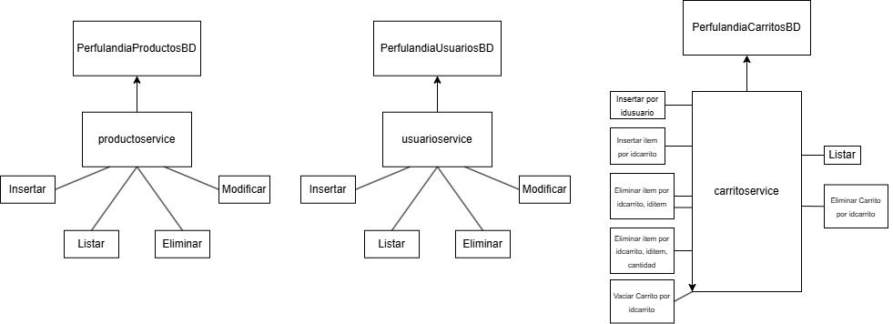

- `productoservice`: > 📝 Microservicio dedicado a Listar, Buscar, Insertar, Eliminar y productos.
- `usuarioservice`: > 📝 Microservicio dedicado a Listar, Buscar, Insertar y Eliminar usuarios.
- `carritoservice`: > 📝 Microservicio dedicado a Listar, Buscar, Insertar.

### Microservicios Desarrollados

- `productservice` 
- `usuarioservice`
- `carritoservice`

## 🛠️ Tecnologías Utilizadas

- `IntelliJ`
- `GitHub`
- `MySQL (Laragon)`
- `Lombok`
- `Maven`
- `Spring web`
- `Spring Data JPA`
- `Spring Boot Dev Tools`
- `MySQL Driver`
- `Postman`

## 🗄️ Configuración de Bases de Datos

El motor utilizado para la base de datos fue MySQL, esta base de datos fue configurada en el archivo `application.properties`, las tablas y las relaciones fueron creadas dentro de las mismas APIs.

Sintaxis de `application.properties`:
```
Sintaxis para carritoservice:

spring.application.name=carritoservice
server.port=8083
spring.datasource.url=jdbc:mysql://localhost:3306/perfulandia_carritos
spring.datasource.username=root
spring.datasource.password=
spring.jpa.hibernate.ddl-auto=update
spring.jpa.show-sql=true
spring.jpa.properties.hibernate.dialect=org.hibernate.dialect.MySQL8Dialect
```

```
Sintaxis para productservice:

spring.application.name=productservice

server.port=8082

spring.datasource.url=jdbc:mysql://localhost:3306/perfulandia_productos
spring.datasource.username=root
spring.datasource.password=

spring.jpa.hibernate.ddl-auto=update
spring.jpa.show-sql=true
spring.jpa.properties.hibernate.dialect=org.hibernate.dialect.MySQLDialect
```

```
Sintaxis para usuarioservice:

spring.application.name=usuarioservice

server.port=8081

spring.datasource.url=jdbc:mysql://localhost:3306/perfulandia_usuarios
spring.datasource.username=root
spring.datasource.password=

spring.jpa.hibernate.ddl-auto=update
spring.jpa.show-sql=true
spring.jpa.properties.hibernate.dialect=org.hibernate.dialect.MySQL8Dialect
```

## 📮 Endpoints y Pruebas

### Endpoints API Carrito  
• Listar todos los carritos (GET /api/carritos) 
>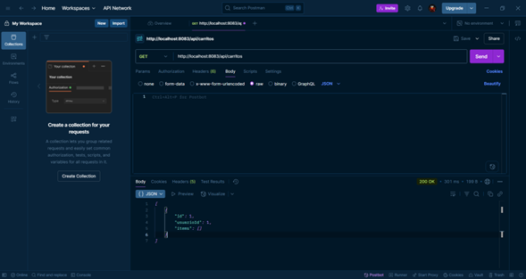  

• Buscar un carrito por ID (GET /api/carritos/{id})  
>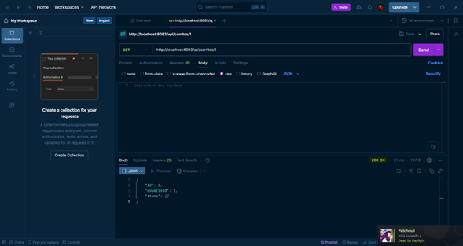

• Crear un nuevo carrito para un usuario (POST /api/carritos/{usuarioId})  
>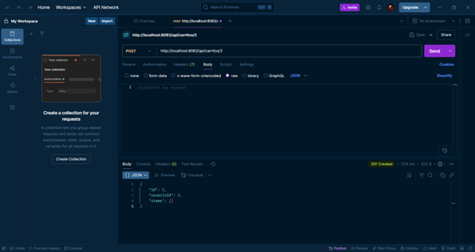

• Agregar un producto al carrito (POST /api/carritos/{carritoId}/items)  
>

• Eliminar una cantidad especifica de un producto del carrito (DELETE
/api/carritos/{carritoId}/items)  
>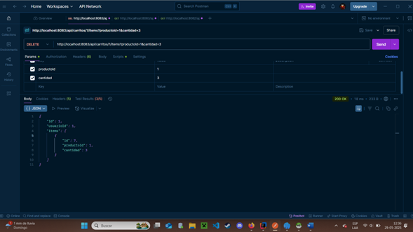

• Eliminar completamente un producto del carrito (DELETE
/api/carritos/{carritoId}/productos/{productoId})  
>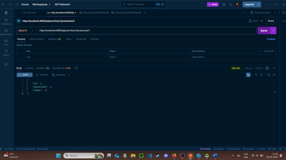  

• Vaciar completamente un carrito (PUT /api/carritos/{carritoId}/vaciar)  
>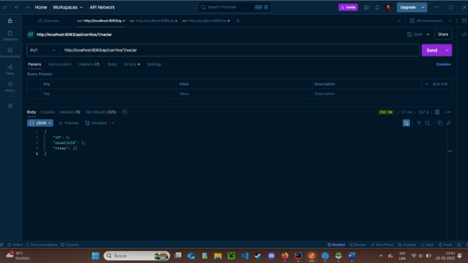  

• Eliminar un carrito por completo por ID (DELETE /api/carritos/{id})  
>


### Endpoints API Producto 
• Listar todos los productos (GET /api/productos)  
>   

• Crear un nuevo producto (POST /api/productos)  
>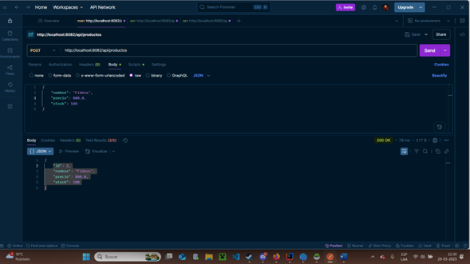  

• Buscar un producto por ID (GET /api/productos/{id})  
>  

• Eliminar un producto por ID (DELETE /api/productos/{id})  
>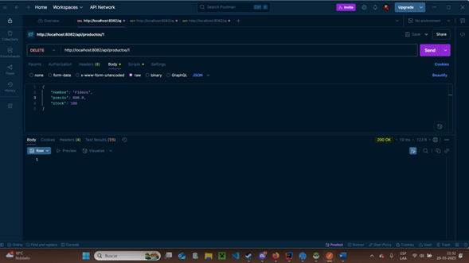  
  
• Buscar un usuario por su ID (GET /api/productos/usuario/{id})  
>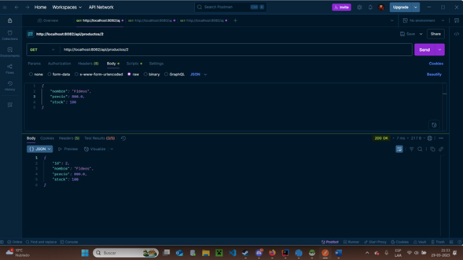  


### Endpoints API Usuario 
• Listar todos los usuarios (GET /api/usuarios)  
>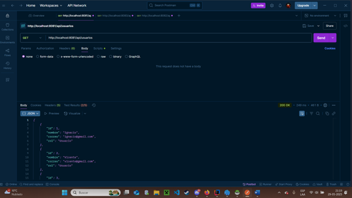  

• Crear un nuevo usuario (POST /api/usuarios)  
>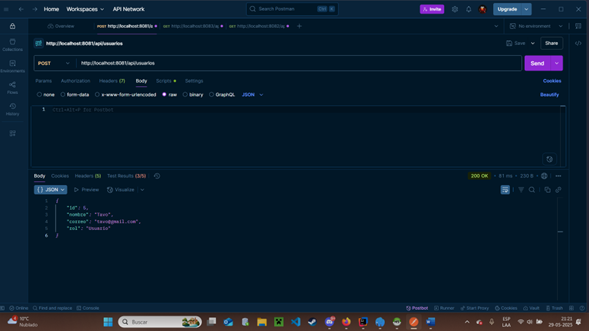  

• Buscar un usuario por ID (GET /api/usuarios/{id})  
>  

• Eliminar un usuario por ID (DELETE /api/usuarios/{id})  
>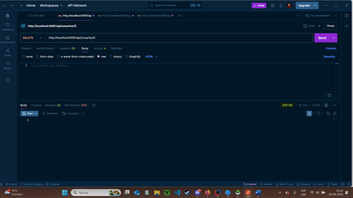  


## 🧑‍💻 Integrantes del Equipo

| Nombre                  | Rol en el proyecto         |
|-------------------------|----------------------------|
| Vicente Alarcón Gallardo| Documentación .README      |
| Ignacio Bittner Navea   | Desarrollo de la API       |
| Benjamin Martinez Oyarzo| Desarrollo de la API       |
| Francisco Aránguiz Inostroza| Desarrollo Informe     |

## 📂 Estructura del Repositorio

Cada microservicio se encuentro almacenado en su propio archivo. Además de contar con archivos generados por el mismo IntelliJ y otro archivo para almacenar assets para el `README.md`.  
<br> 
`.idea`: Archivo dedicado al almacenamiento de METADATOS, generados automaicamente por IntelliJ.  
`carritoservice`, `productoservice`, `usuarioservice`: Microservicios.  
`readme-assets`: archivo dedicado a almacenar imagenes para poder ser ocupadas dentro del `README.md`.  
`README.md`: Documento con toda la información importante acerca del repositorio y los microservicios.

```

📦 perfulandia-backend
├── .idea
├── carritoservice
├── productoservice
├── readme-assets
├── usuarioservice
└── README.md

```

## 👥 Colaboración en GitHub

Cada Integrante cuenta con su propia rama en la cual trabaja sus propios avances, y mejorando codigo u otro documentos de los demás.
> 

Descripcion de las Ramas:  
    - `Master`: Esta es la rama principal, en la cual se trabaja cuando queremos hacer un cambio rapido al repositorio.  
    <br>
    - `Rama-Vicente`: Como dice el nombre, esta rama pertenece al integrante `Vicente Alarcón`, el cual trabaja exclusivamente en esta rama.  
    <br>
    - `Rama-Nacho`: Al igual que la anterior, Esta rama pertenece al integrante `Ignacio Bittner`. Rama la cual esta destinada al uso exclusivo del integrante el cual lleva su nombre en la rama.  
    <br>
    - `Rama-Francisco`: Rama perteneciente al integrante `Francisco Aranguiz`, rama destinada al mismo uso que las anteriores.  
    <br>
    - `Rama-Benjamin`: Rama perteneciente al integrante `Benjamin Martinez`, rama destinada para el uso exclusivo del integrante el cual lleva su nombre esta rama.  
    <br>
    Si bien ya se menciono, cabe aclarar que cada rama es de uso EXCLUSIVO para el integrante cuyo nombre aparezca en la rama, por ejemplo:  
    `Rama-Vicente` ---> SOLO PODRA SER USADA POR `VICENTE ALARCÓN`  
    <br>
    Esto se hizo de esta forma, para darle a cada integrante su propio espacio en el cual puedan desenvolverse a gusto, creando y testeando su codigo para finalmente enviar un `pull request` hacia la rama principal `Master`.  
    


📝 Explicar cómo se organizó el trabajo en ramas (`master`, `pruebas`), frecuencia de commits y cómo se coordinaron como equipo.

## 📈 Lecciones Aprendidas

Durante el desarrollo de este proyecto, nosotros aprendimos a trabajar en equipo. Aprendimos que es una buena practica ir documentando los avances dentro del archivo `README.md`, también el propio uso de este archivo. Tambien aprendimos sobre las conexiones de MySQL con Java, además de aprender a usar anotaciones y crear `Endpoints` para las `APIs`. Y finalmente también aprendimos al manejo de repositorios en `Github` y el trabajo dentro de `Ramas`.

---

[Guía Oficial en Notion – Evaluación Parcial 2 (35%)](https://quilt-canary-969.notion.site/Gu-a-Oficial-Evaluaci-n-Parcial-2-35-1f75b3c4e31280aaab79c9a71f1cfb7b?pvs=4)